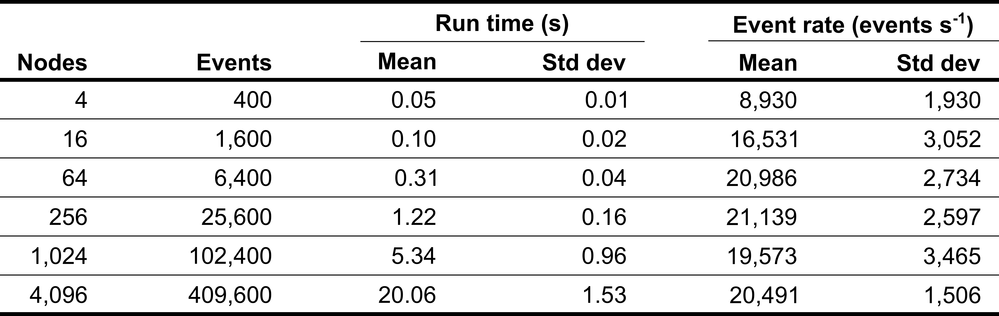

# Summary

Discrete-event simulation (DES) is a simulation method that analyzes systems whose events occur at discrete instants in time.
Events and their simulation times are dynamically determined.
Many fields employ models that use DES, including biochemical modeling, computer network performance analysis, war gaming, modeling of infectious disease transmission, and others [@banks2005discrete].

The construction of a DES model can be simplified and accelerated by using a DES simulator that implements the generic features needed by all DES models, such as executing events in increasing simulation time order.
Model construction can be further enhanced, and models can be made more comprehensible and reusable, by structuring models as object-oriented programs.
This approach, known as *object-oriented discrete-event simulation* (OO DES), recommends that modelers represent entities in the system being modeled as objects in a model, and represent interactions between entities as event messages exchanged between objects.
OO DES was invented in the 1960s by the SIMULA language [@dahl1966simula; @nygaard1978development] and continues with modern languages such as SystemC [@mueller2001simulation; @ieee2012ieee] and SIMUL8 [@concannon2003dynamic].

DE-Sim is a Python package that supports OO DES simulations.

# Research purpose

DE-Sim is needed by researchers who want to build OO DES models in Python because existing open source Python simulators do not support an object-oriented, message-passing interface.
For example, we have used DE-Sim to create a multi-algorithmic simulator of models that comprehensively represent the biochemical dynamics in individual biological cells [@goldberg2020wc_sim].

Another benefit of implementing models in the object-oriented, message-passing framework supported by DE-Sim is that parallel DES simulation can reduce the runtimes of their simulations, which are often inconveniently long.
The OO DES framework makes parallel simulation feasible because 1) objects that do not share memory references can be distributed on multiple processors, and 2) a parallel DES simulator interfaces with simulation objects the event messages that are used to schedule events by OO DES applications [@Jefferson1985; @Barnes2013; @Carothers2000].
Examples of research models that may be accelerated by parallel simulation include epidemic outbreak phenomena [@perumalla2012discrete] and comprehensive models of the biochemistry of human cells [@goldberg2016toward].

# DE-Sim features

A OO DES application that uses DE-Sim can be defined in three steps:

1: Event message types are defined by subclassing `SimulationMessage`.

```python
class MessageSentToSelf(SimulationMessage):
    "A message type with no attributes"

class MessageWithAttribute(SimulationMessage):
    'An event message type with an attribute'
    attributes = ['attr_1']
```

A message must be documented by a docstring, and may include attributes.

2: Define simulation application objects by subclassing `ApplicationSimulationObject`.

```python
class MinimalSimulationObject(ApplicationSimulationObject):

    def __init__(self, name, delay):
        self.delay = delay
        super().__init__(name)

    def send_initial_events(self):
        self.send_event(self.delay, self, MessageSentToSelf())

    def handle_simulation_event(self, event):
        self.send_event(self.delay, self, MessageSentToSelf())

    event_handlers = [(MessageSentToSelf, handle_simulation_event)]

    # register the message types sent
    messages_sent = [MessageSentToSelf]
```

Each simulation object must have a unique `name`.
This example also includes a class attribute for the delay between events.
All application simulation objects have a read-only attribute called `time` that always provides the current simulation time.

A simulation object may include a `send_initial_events` method, which, if present, will be called by the simulator during initialization to send the object's initial events.
A simulation must send at least one initial event.

A simulation object must include at least one method that handles simulation events.
The simulator vectors incoming message types as directed by an `event_handlers` attribute that associates each message type received by an object with a simulation object method.

`ApplicationSimulationObject` provides the method
`send_event(delay, receiving_object, event_message)` which schedules an event to occur `delay` time units in the future.
`event_message` is an instance of a `SimulationMessage`, and may have attributes that contain data used by the event.
The event will be executed by an event handler in simulation object `receiving_object`, which will receive a simulation event containing `event_message`.
All simulation events in this example are scheduled for the object that creates the event.

3: Execute a simulation by creating a `SimulationEngine`, instantiating the application objects, sending their initial event messages, and running the simulation.

```python
# create a simulation engine
simulation_engine = SimulationEngine()

# create a simulation object and add it to the simulation
simulation_engine.add_object(MinimalSimulationObject('object_1', 6))

# initialize and run the simulation
simulation_engine.initialize()
num_events = simulation_engine.run(25)
```
This runs the simulation for 25 time units, and returns the number of events executed.

DE-Sim offers many additional features:

* Simple configuration from files
* Periodic checkpoints
* Control of simulation termination by a Python function that returns a boolean
* Recording of simulation run metadata, including start time, run time, and IP address
* Extensive error detection
* Logging
* Performance profiling using Python's `cProfile` package
* Memory use analysis using Python's `pympler.tracker` package
* Quick construction of periodic simulation objects from a template
* Extensive documentation
* Comprehensive unittests

# DE-Sim performance

DE-Sim is a pure Python application.
It achieves decent performance by using Python's `heapq` priority queue package to schedule events.
\autoref{fig:performance} reports the performance of DE-Sim for a range of simulation sizes.
We present the statistics of three runs made in a Docker container executing on a 2.9 GHz Intel Core i5 processor in a MacBook.



# Example discrete-event simulation

DE-Sim includes an example simulation that implements the PHOLD [@fujimoto1990performance] parallel DES benchmark (see `phold.py` in the `examples` directory).
Fig X presents a space-time visualization (a computational variant of a Feynman diagram, transposed with time increasing down) of one simulation run of PHOLD.
PHOLD uses only one simulation application object class, `PholdSimulationObject`.
Each `PholdSimulationObject` instance occupies a vertical lane in the figure, and each event message is indicated by a directed arrow.
The tail of the arrow is located at the (object instance, simulation time) coordinates of the simulation when the event message was created and sent, and the head of the arrow is located at the simulation coordinates of the object and time when the event message is executed.

# Acknowledgements

This worked was supported by National Science Foundation award 1649014 and National
Institutes of Health award R35GM119771 to J.R.K.

# References
